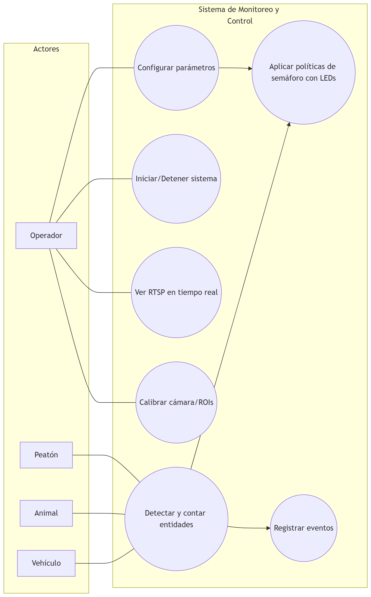
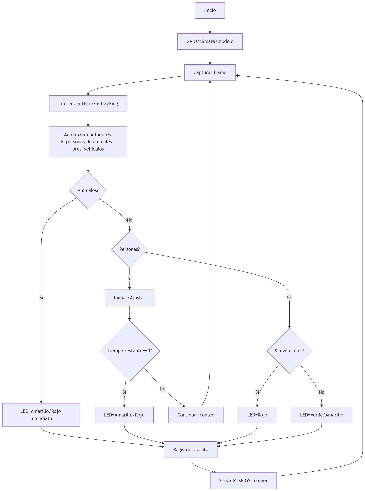

# EL5841 Taller de Sistemas Embebidos

**Murillo Vega Milton**, **Marcos Josue Marin Vargas**, **Rodriguez Rocha Fernando Jose**  
Estudiantes, Tecnológico de Costa Rica  

**Cruces inteligentes con EDGE AI embebido**

### Introducción

### Justificación

### Recursos
#### Hardware
* Raspberry Pi 4/5 (≥4 GB), microSD/SSD.

* Cámara (PiCam).

* LEDs R/A/V + resistencias.

* Protoboard/caja, fuente.

* Punto de acceso Wi-Fi.

#### Software
* Linux embebido (Yocto) + systemd.
 
* GStreamer (+ gst-rtsp-server) para RTSP.
 
* OpenCV + TensorFlow Lite.

* Tracker (SORT/OC-SORT), lógica de políticas del semáforo, servicio GPIO.
 
* Telemetría básica VLC FFmpeg con un servidor RTSP.

* Integración de flujo con python.

#### Requerimientos

Detección/seguimiento de personas/animales/vehículos.

Políticas:

* Animal → Amarillo-rojo. Transición inmediata (LED A, R).

* Personas → Amarillo-rojo. Transición dinámica; Tiempo inicial 3 min, reducción dinámica por persona 30 s.

* Sin vehículos → Rojo. Transito de personas y animales.

* Salida a LEDs (R/A/V) y exposición del RTSP con video en tiempo real.

* Paso de personas 1 min.

* Detectar carros nuevamente → dar paso dentro de 1 min.

* Paso de animales 2 min.

  
   
  <b>Fig. 1. Diagrama de Concepto de Operaciones.</b>

  
   
  <b>Fig. 2. Flujo de trabajo del sistema.</b>

